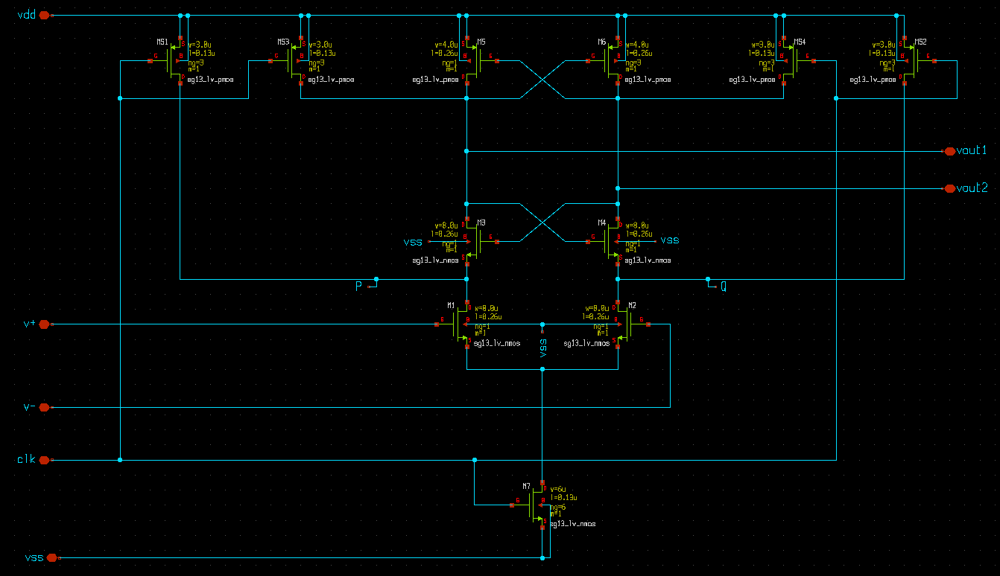
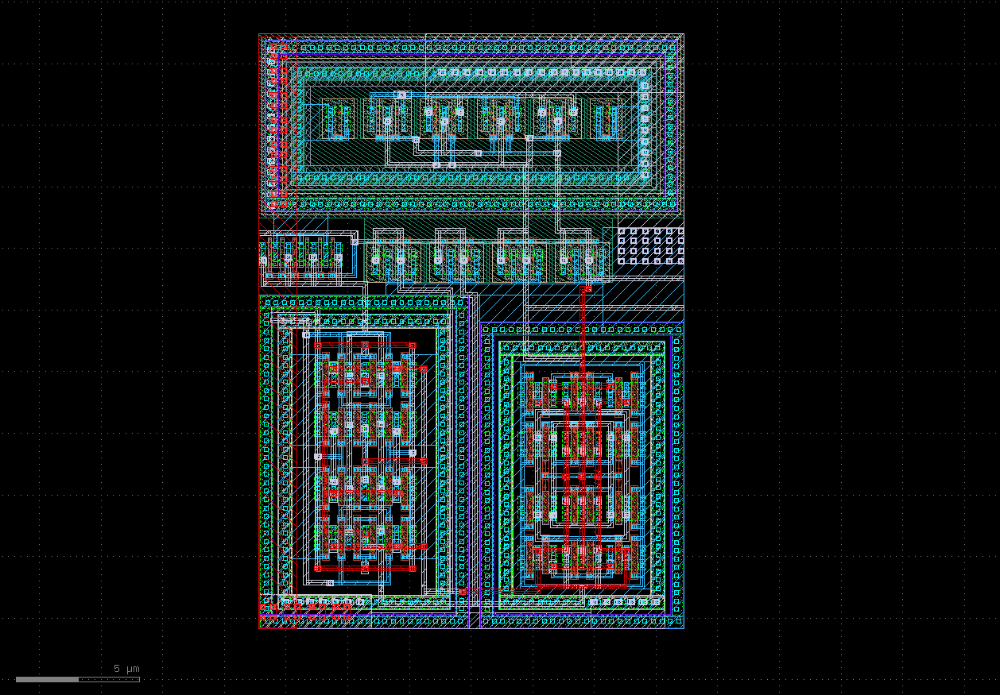
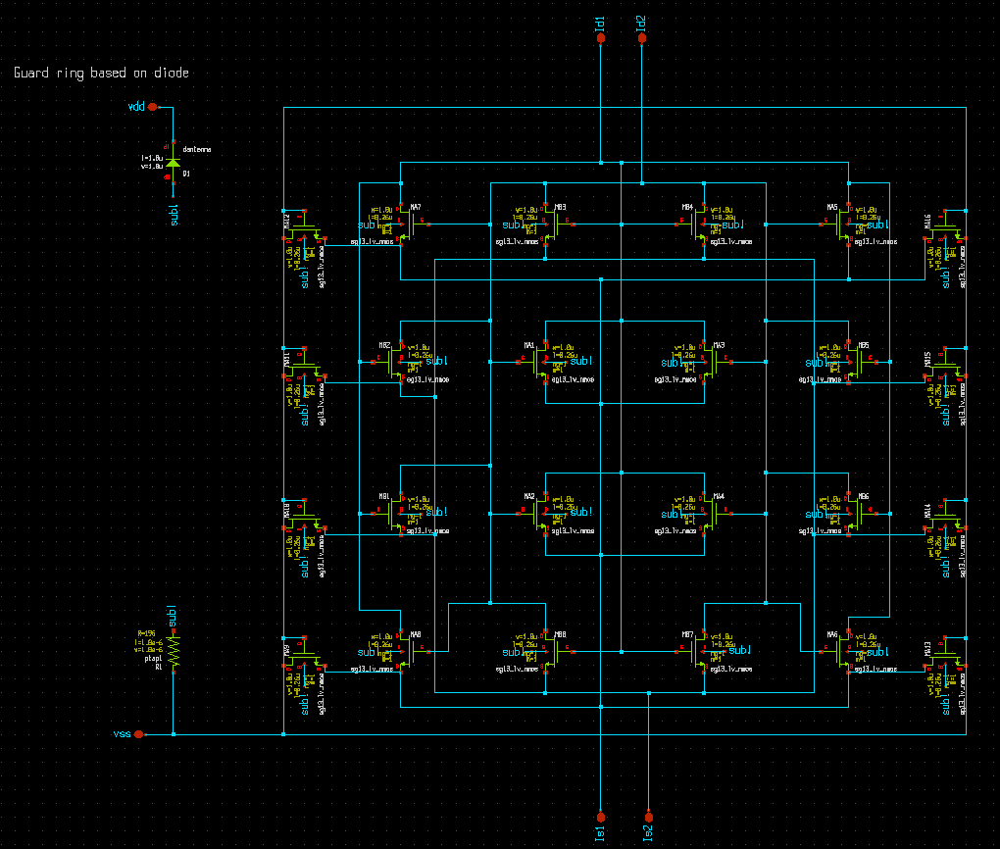
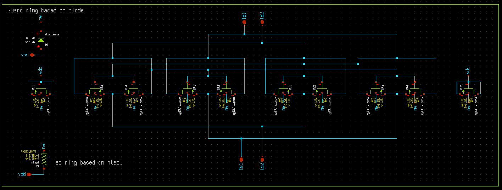
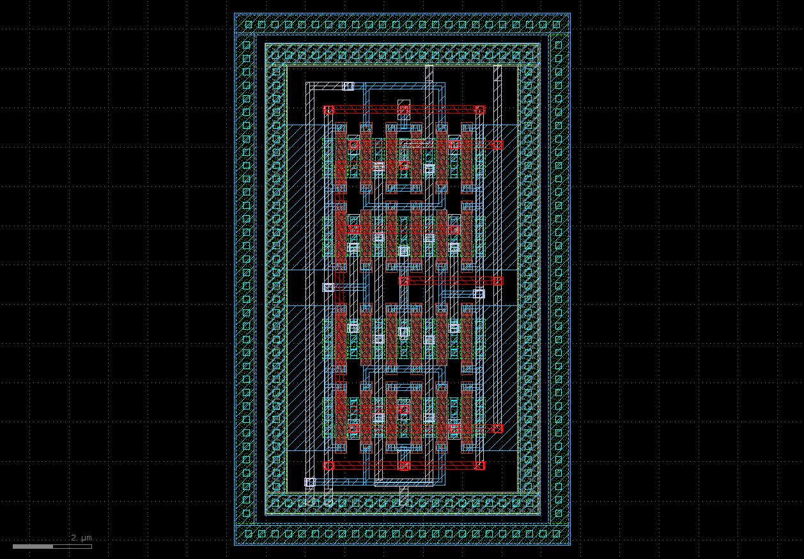
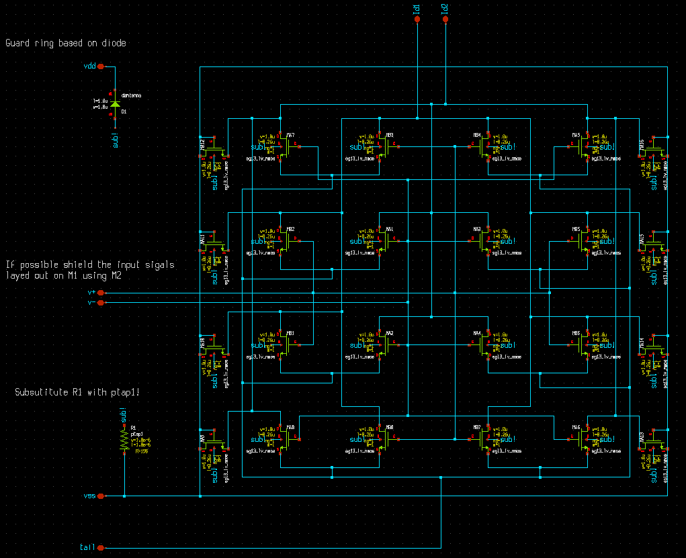
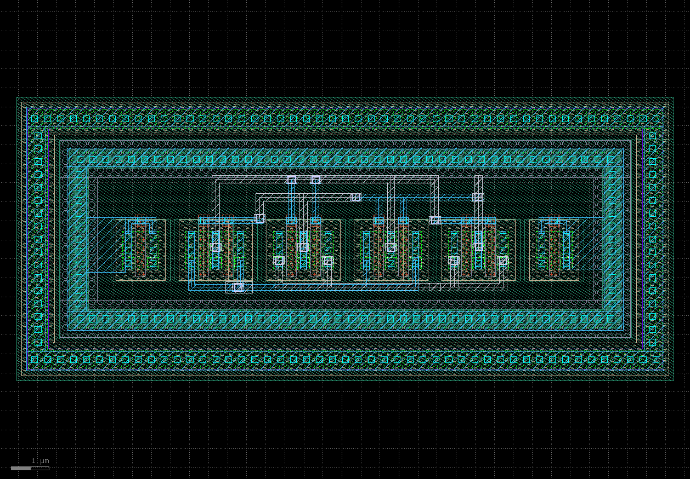
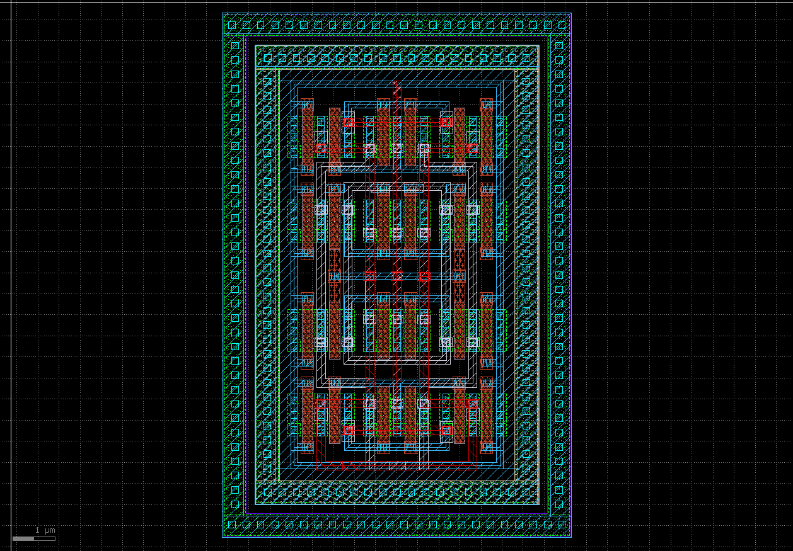
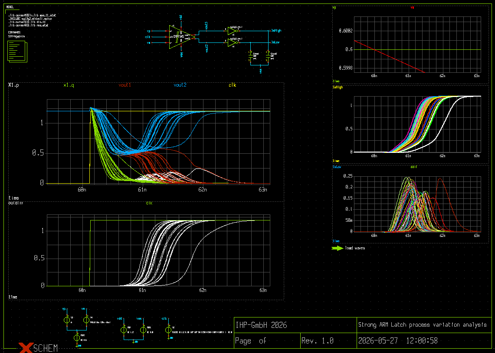
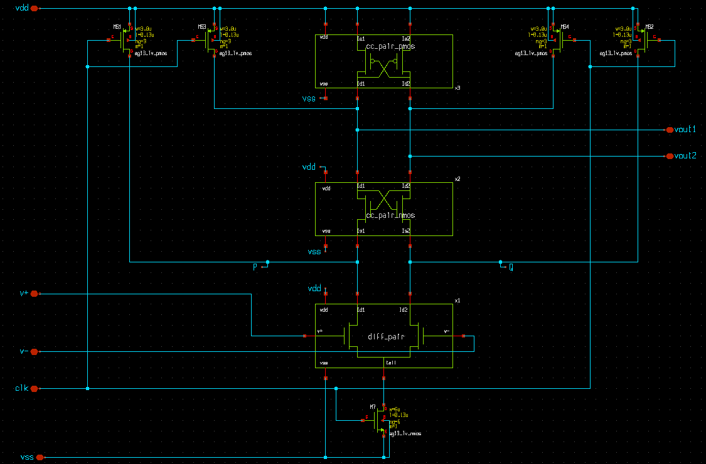

# CMP7345 Strong ARM Comparator 

# Architecture 

The architecture is a typical one for a Strong ARM comparator shown on the figure below. 

# Mismatch compansation 

In order to reduce the effect of mismatch a common centroid layout was applied for the differential pair M1,2,
and cross-coupled pairs: M3,4 and M5,6. The final architecture is shown on the next figure and it also contains 
the precharge switches MS1-4 and the tail switch M7.

### cc_pari_pmos

### diff_pair

### layout_cc_pair_nmos

### layout_cc_pair_pmos

### layout_diff_pair

### layout-final

### process

### schem-final

